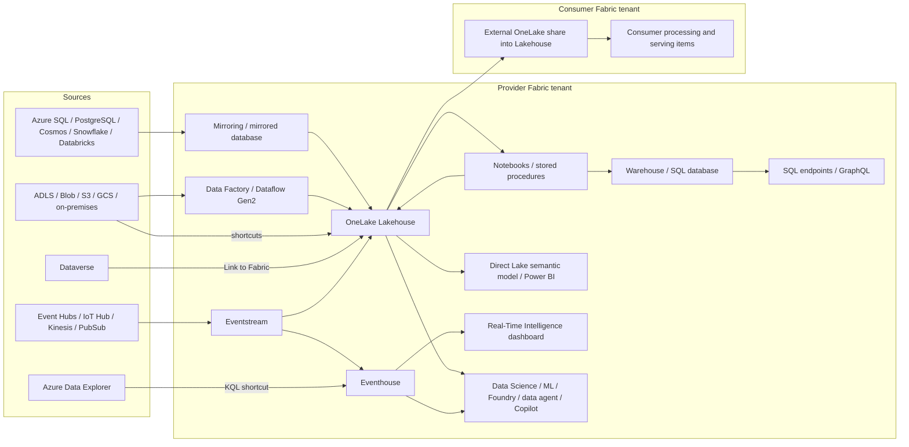

# Azure + Microsoft Fabric: end-to-end analytics repository

Repository blueprint for the **supplied `azure-analytics-end-to-end.svg` architecture**.
The original diagram is preserved in [docs/architecture](docs/architecture/azure-analytics-end-to-end.svg).
All 66 unique diagram labels are mapped to repository artifacts in
[coverage.md](docs/coverage.md), including the multicloud sources and consumer tenant.

**Nothing has been deployed.** This repository contains working offline sample code,
Azure infrastructure templates, parameterized Fabric item definitions, SQL/KQL/M
transformations, and explicit configuration contracts for tenant-bound integrations.
It is **not** a claim that every service is already connected or a one-command,
production-tested implementation. Read [implementation status](docs/status.md).

## Quick start — no Azure account needed

Python 3.10+; no pip packages are required for these commands:

```powershell
python scripts/build_definitions.py
python scripts/validate_repo.py
python -m unittest discover -s tests -v
python scripts/local_demo.py
python scripts/stream_producer.py --count 100
python scripts/fabric_items.py
```

The local sample produces `build/local-demo/`:

- 5 input rows → 3 valid latest orders and 1 quarantined row.
- September 1, 2026: **159.85 USD**; September 2: **200.00 USD**.
- Total: **359.85 USD**, 3 orders, average order value **119.95 USD**.
- The stream producer writes local JSONL unless `--send` is explicitly supplied.
- `fabric_items.py` prints an offline plan unless `--apply` is explicitly supplied.

Roman Urdu: Ye repo architecture ke mutabiq tayyar ki gayi hai. Abhi cloud par kuch
deploy nahi hua. Aap code, templates aur tamam branches ka structure dekh sakte
hain; asal deployment ke liye apne tenant IDs, accounts aur connections bind karne honge.

## Repository map

```text
infra/azure/          Bicep: Fabric capacity, sources, storage, streaming, AI/ML,
                     Purview, Key Vault, monitoring, networking, policy, budget
infra/aws/            CloudFormation: S3 + Kinesis source branch
infra/gcp/            Terraform: Cloud Storage + Pub/Sub source branch
fabric/manifests/     Provider, consumer, streaming and semantic-model manifests
fabric/notebooks/     Bronze → Silver → Gold plus ML source code
fabric/definitions/   Generated importable notebooks and orders pipeline
fabric/connections/   Source inventory, mirroring and shortcuts setup
fabric/eventstreams/  Event Hubs/Lakehouse definition + full topology contract
fabric/sql/           Warehouse procedures, Fabric SQL database, SQL checks
fabric/kql/           Eventhouse schema, mapping, queries, OneLake path
fabric/dataflows/     Power Query M and Dataflow Gen2 destination contract
fabric/semantic-model/ Direct Lake TMSL model and DAX measures
fabric/reports/       Report/dashboard authoring specifications and theme
fabric/graphql/      API setup contract and sample query
fabric/consumer/     Cross-tenant consumption and processing setup
sources/             Azure SQL, PostgreSQL, Cosmos, Databricks, Snowflake,
                     on-premises SQL Server and Dataverse sample assets
ml/                  Local/Azure ML training sample and job configuration
ai/                  Fabric data-agent instructions/evaluation and Foundry setup
governance/           Access matrix and Purview operating model
monitoring/           Observability and alert contracts
src/                 Local data processing and Fabric REST helper
scripts/             Validation, generation, planning, sample upload/producer
tests/               Offline processing, REST behavior and preflight tests
docs/                Architecture, coverage, deployment, runbooks and limitations
.github/workflows/   GitHub validation CI — no deployment
azure-pipelines.yml  Azure DevOps validation CI — no deployment
```

## Architecture



This is a navigation summary. The supplied SVG remains the authoritative visual.
Platform controls (Entra, Key Vault, Purview, Policy, CI/CD, monitoring and cost)
are cross-cutting; they are documented separately rather than omitted.

## How to review

1. [Architecture decisions](docs/architecture.md): which components do what.
2. [Component coverage](docs/coverage.md): original labels → exact files and status.
3. [Implementation status](docs/status.md): implemented versus tenant-bound work.
4. [Deployment runbook](docs/deployment.md): future setup order and prerequisites.
5. [Operations](docs/operations.md): failures, replay, recovery and acceptance.
6. [Official references](docs/references.md): source APIs and service requirements.

Cloud commands are provided for a future authorized deployment. This repository
does not run those commands through CI and does not include cloud credentials.
F2 and the budget amount are **illustrative development parameters**, not a
capacity recommendation or a cost estimate for all services in the diagram.
